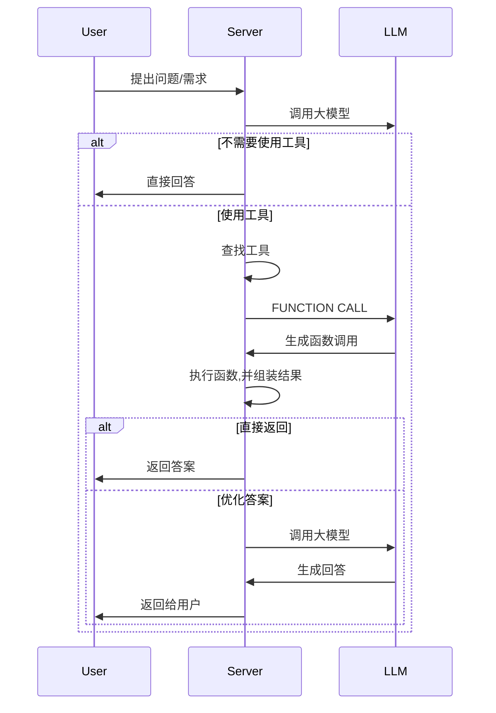
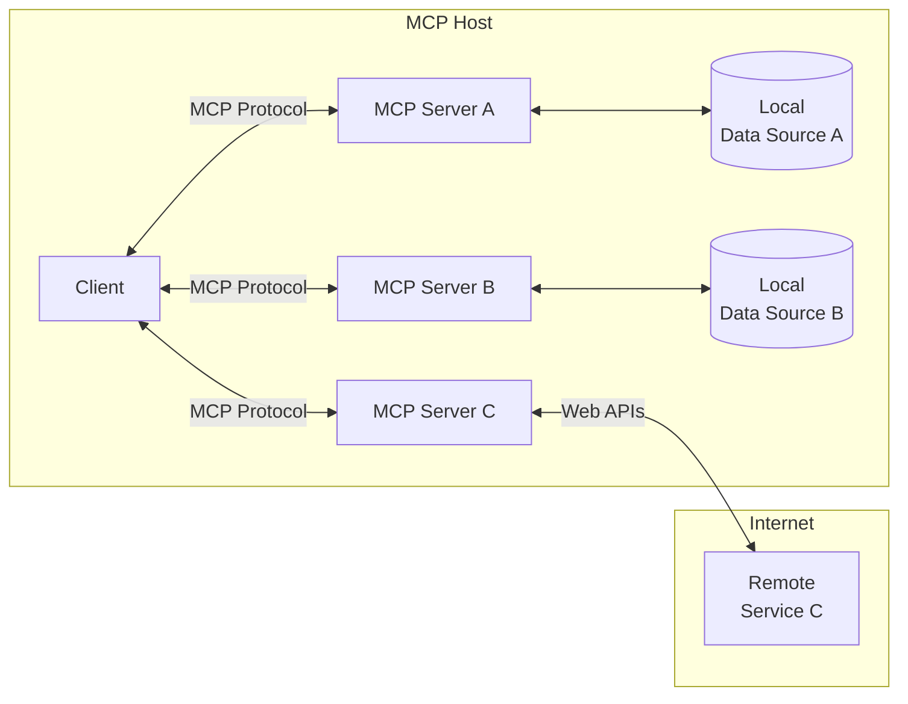
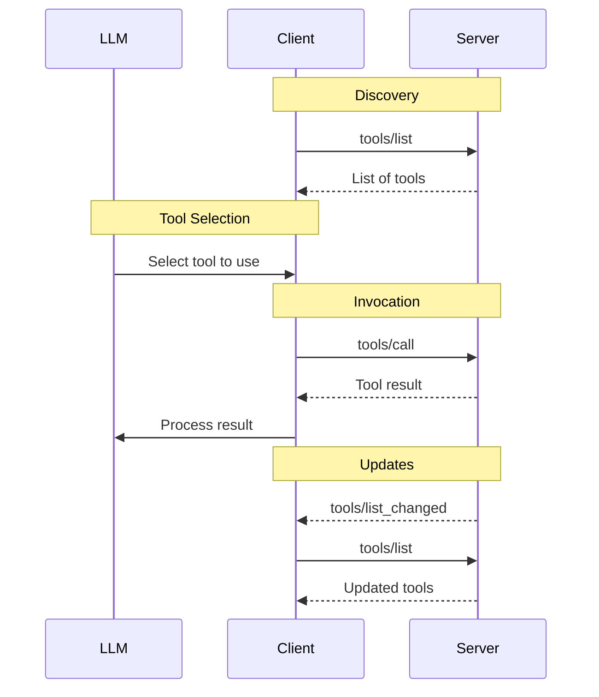

---
cssclasses:
  - editor-full
---
# 名词解释
| 名词  | 解释                                                  |
| --- | --------------------------------------------------- |
| MCP | Model Context Protocol (模型上下文协议)，只是一种协议，不是具体的代码或者框架 |
# 回顾下MCP之前的交互
## 简化流程如下


## 问题
1. 都需要查找工具
2. 都需要做函数调用
3. 每个工具的返回结果可能都不一样，都需要组装，组装的逻辑也可能不一致
# 什么是MCP
在MCP之前，我们在使用一些外部函数的时候,就像上面的流程图一样。需要根据不同的工具设置不同的规则，就像每把钥匙适配不同的锁
![[Pasted image 20250326153907.png]]

模型上下文协议 (MCP) 是一种标准化协议，可将 AI 代理连接到各种外部工具和数据源。可以将其想象为 USB-C 端口
![[Pasted image 20250326153654.png]]

# 整体架构

## 参与角色
### MCP Host
宿主环境，比如说Claude Desktop, 或者VSCODE（安装了CLIENT插件)或者Cursor
### MCP Client
负责和MCP SERVER交互，可以实时和MCP SERVER通信，一般情况下用户不用开发，直接通过HOST使用
目前大部分的Client主要支持Tools的使用，详细列表如下：

| Client                                                                                             | [Resources](https://modelcontextprotocol.io/docs/concepts/resources) | [Prompts](https://modelcontextprotocol.io/docs/concepts/prompts) | [Tools](https://modelcontextprotocol.io/docs/concepts/tools) | [Sampling](https://modelcontextprotocol.io/docs/concepts/sampling) | Roots | Notes                                                              |
| -------------------------------------------------------------------------------------------------- | -------------------------------------------------------------------- | ---------------------------------------------------------------- | ------------------------------------------------------------ | ------------------------------------------------------------------ | ----- | ------------------------------------------------------------------ |
| [Claude Desktop App](https://claude.ai/download)                                                   | ✅                                                                    | ✅                                                                | ✅                                                            | ❌                                                                  | ❌     | Full support for all MCP features                                  |
| [Claude Code](https://claude.ai/code)                                                              | ❌                                                                    | ✅                                                                | ✅                                                            | ❌                                                                  | ❌     | Supports prompts and tools                                         |
| [5ire](https://github.com/nanbingxyz/5ire)                                                         | ❌                                                                    | ❌                                                                | ✅                                                            | ❌                                                                  | ❌     | Supports tools.                                                    |
| [BeeAI Framework](https://i-am-bee.github.io/beeai-framework)                                      | ❌                                                                    | ❌                                                                | ✅                                                            | ❌                                                                  | ❌     | Supports tools in agentic workflows.                               |
| [Cline](https://github.com/cline/cline)                                                            | ✅                                                                    | ❌                                                                | ✅                                                            | ❌                                                                  | ❌     | Supports tools and resources.                                      |
| [Continue](https://github.com/continuedev/continue)                                                | ✅                                                                    | ✅                                                                | ✅                                                            | ❌                                                                  | ❌     | Full support for all MCP features                                  |
| [Cursor](https://cursor.com/)                                                                      | ❌                                                                    | ❌                                                                | ✅                                                            | ❌                                                                  | ❌     | Supports tools.                                                    |
| [Emacs Mcp](https://github.com/lizqwerscott/mcp.el)                                                | ❌                                                                    | ❌                                                                | ✅                                                            | ❌                                                                  | ❌     | Supports tools in Emacs.                                           |
| [fast-agent](https://github.com/evalstate/fast-agent)                                              | ✅                                                                    | ✅                                                                | ✅                                                            | ✅                                                                  | ✅     | Full multimodal MCP support, with end-to-end tests                 |
| [Firebase Genkit](https://github.com/firebase/genkit)                                              | ⚠️                                                                   | ✅                                                                | ✅                                                            | ❌                                                                  | ❌     | Supports resource list and lookup through tools.                   |
| [GenAIScript](https://microsoft.github.io/genaiscript/reference/scripts/mcp-tools/)                | ❌                                                                    | ❌                                                                | ✅                                                            | ❌                                                                  | ❌     | Supports tools.                                                    |
| [Goose](https://block.github.io/goose/docs/goose-architecture/#interoperability-with-extensions)   | ❌                                                                    | ❌                                                                | ✅                                                            | ❌                                                                  | ❌     | Supports tools.                                                    |
| [LibreChat](https://github.com/danny-avila/LibreChat)                                              | ❌                                                                    | ❌                                                                | ✅                                                            | ❌                                                                  | ❌     | Supports tools for Agents                                          |
| [mcp-agent](https://github.com/lastmile-ai/mcp-agent)                                              | ❌                                                                    | ❌                                                                | ✅                                                            | ⚠️                                                                 | ❌     | Supports tools, server connection management, and agent workflows. |
| [oterm](https://github.com/ggozad/oterm)                                                           | ❌                                                                    | ❌                                                                | ✅                                                            | ❌                                                                  | ❌     | Supports tools.                                                    |
| [Roo Code](https://roocode.com/)                                                                   | ✅                                                                    | ❌                                                                | ✅                                                            | ❌                                                                  | ❌     | Supports tools and resources.                                      |
| [Sourcegraph Cody](https://sourcegraph.com/cody)                                                   | ✅                                                                    | ❌                                                                | ❌                                                            | ❌                                                                  | ❌     | Supports resources through OpenCTX                                 |
| [Superinterface](https://superinterface.ai/)                                                       | ❌                                                                    | ❌                                                                | ✅                                                            | ❌                                                                  | ❌     | Supports tools                                                     |
| [TheiaAI/TheiaIDE](https://eclipsesource.com/blogs/2024/12/19/theia-ide-and-theia-ai-support-mcp/) | ❌                                                                    | ❌                                                                | ✅                                                            | ❌                                                                  | ❌     | Supports tools for Agents in Theia AI and the AI-powered Theia IDE |
| [Windsurf Editor](https://codeium.com/windsurf)                                                    | ❌                                                                    | ❌                                                                | ✅                                                            | ❌                                                                  | ❌     | Supports tools with AI Flow for collaborative development.         |
| [Witsy](https://github.com/nbonamy/witsy)                                                          | ❌                                                                    | ❌                                                                | ✅                                                            | ❌                                                                  | ❌     | Supports tools in Witsy.                                           |
| [Zed](https://zed.dev/)                                                                            | ❌                                                                    | ✅                                                                | ❌                                                            | ❌                                                                  | ❌     | Prompts appear as slash commands                                   |
| [SpinAI](https://spinai.dev/)                                                                      | ❌                                                                    | ❌                                                                | ✅                                                            | ❌                                                                  | ❌     | Supports tools for Typescript AI Agents                            |
| [OpenSumi](https://github.com/opensumi/core)                                                       | ❌                                                                    | ❌                                                                | ✅                                                            | ❌                                                                  | ❌     | Supports tools in OpenSumi                                         |
| [Daydreams Agents](https://github.com/daydreamsai/daydreams)                                       | ✅                                                                    | ✅                                                                | ✅                                                            | ❌                                                                  | ❌     | Support for drop in Servers to Daydreams agents                    |
| [Apify MCP Tester](https://apify.com/jiri.spilka/tester-mcp-client)                                | ❌                                                                    | ❌                                                                | ✅                                                            | ❌                                                                  | ❌     | Supports tools                                                     |
### MCP Server
轻量级服务器，通过MCP公开特定的功能，连接到本地或者远程服务
### Local Data Source
本地数据、文件、数据库或者服务
### Remote Service
远程服务

# 通信协议
基于HTTP的JSON RPC调用
## JSON RPC

## Server Feature
## Prompt
## Resource
## Tool
### 请求示例：
```json
{
  "jsonrpc": "2.0", // 协议版本
  "id": 1, // 请求ID，必填
  "method": "tools/list", //请求方法
  "params": { // 请求参数
    "cursor": "optional-cursor-value" // cursor为分页信息
  }
}
```
### 响应示例
```json
{
  "jsonrpc": "2.0", 
  "id": 1,
  "result": { 
    "tools": [
      {
        "name": "get_weather",
        "description": "Get current weather information for a location",
        "inputSchema": {
          "type": "object",
          "properties": {
            "location": {
              "type": "string",
              "description": "City name or zip code"
            }
          },
          "required": ["location"]
        }
      }
    ],
    "nextCursor": "next-page-cursor"
  }
}
```
## 交互时序图

## 统一返回结果
### 基本返回结构
```json
{
  "jsonrpc": "2.0",
  "id": 4,
  "result": {
    "content": [
       // 可以是文本或者图片或者嵌入式
    ],
  }
}
```
### 文本
```json
{
  "type": "text",
  "text": "Tool result text"
}
```
### 图片
```json
{
  "type": "image",
  "data": "base64-encoded-data",
  "mimeType": "image/png"
}
```
### 嵌入式
```json
{
  "type": "resource",
  "resource": {
    "uri": "resource://example",
    "mimeType": "text/plain",
    "text": "Resource content"
  }
}
```
### 协议调用错误
```json
{
  "jsonrpc": "2.0",
  "id": 3,
  "error": {
    "code": -32602,
    "message": "Unknown tool: invalid_tool_name"
  }
}
```
### 工具执行报错
```json
{
  "jsonrpc": "2.0",
  "id": 4,
  "result": {
    "content": [
      {
        "type": "text",
        "text": "Failed to fetch weather data: API rate limit exceeded"
      }
    ],
    "isError": true
  }
}
```
